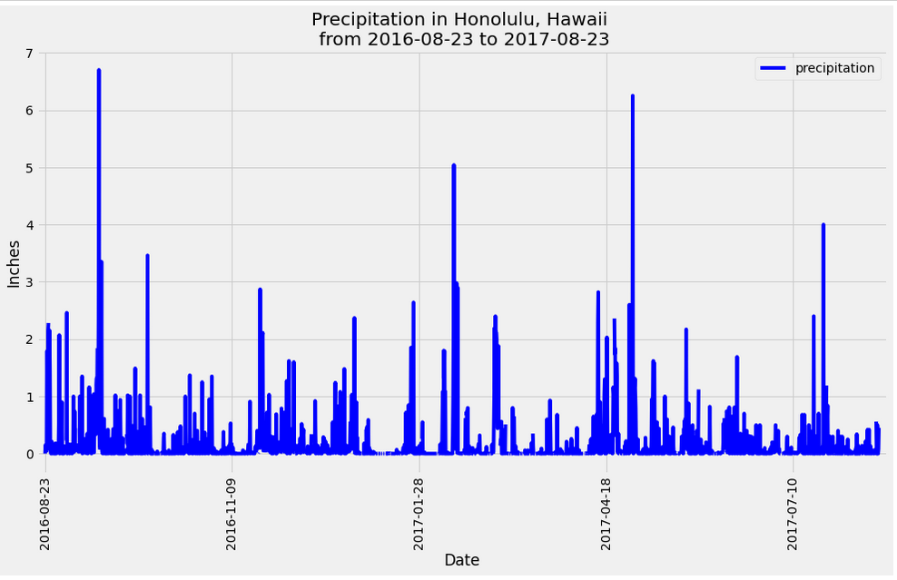
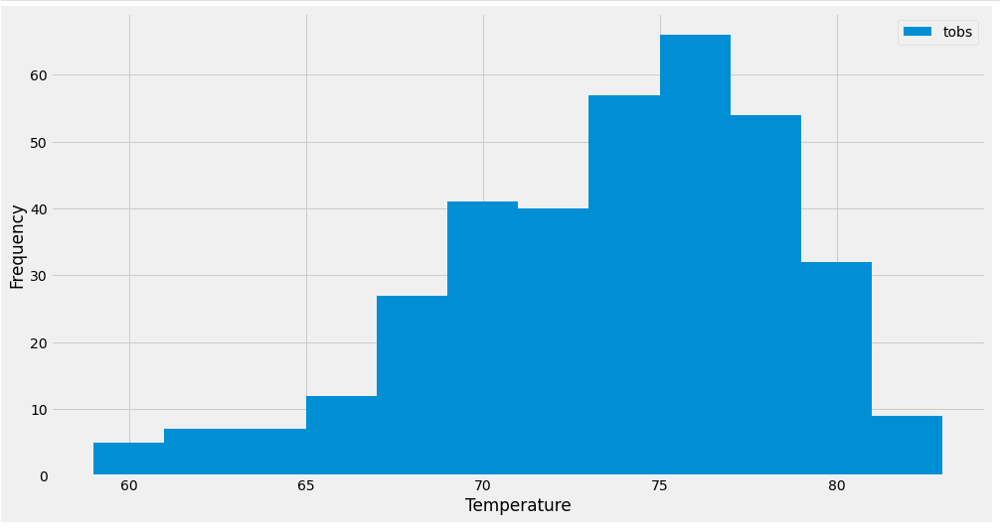
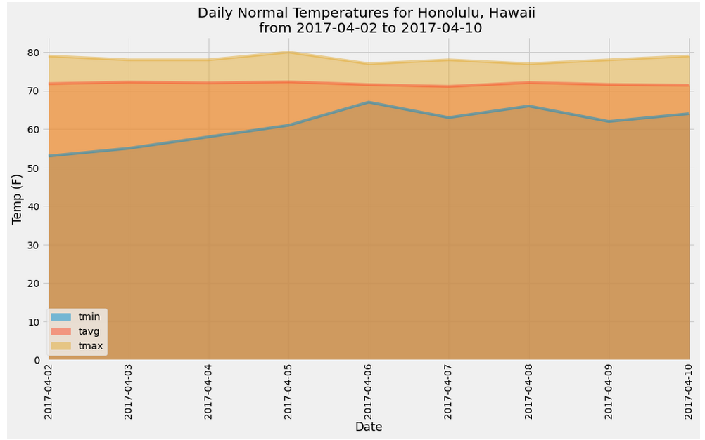

# Honolulu Vacation Climate Analysis

## Overview of the Project
A repository which explores and analyses the climate of Honolulu, Hawaii.

## Part I - Climate Analysis and Exploration
A jupyter notebook which conducts climate analysis and exploration on weather from Honolulu, Hawaii

#### Precipitation Analysis

 

#### Station Analysis
An analysis of station measuresments including the last 12 months of temperature observation data (TOBS).

 

#### Vacation Minimum, Maximum, and Average Temperature

 

## Part II - Climate App
A Flask app which queries an [sqlite database](Resources/hawaii.sqlite) based on the following routes:
- `/`
  - List all routes that are available.
- `/api/v1.0/precipitation`
  - Converts the query results to a dictionary using `date` as the key and `prcp` as the value.
  - Returns the JSON representation of your dictionary.
- `/api/v1.0/stations`
  - Returns a JSON list of stations from the dataset.
- `/api/v1.0/tobs`
  - Queried the dates and temperature observations of the most active station for the last year of data.
  - Returns a JSON list of temperature observations (TOBS) for the previous year.
- `/api/v1.0/<start>` and `/api/v1.0/<start>/<end>`
  - Returns a JSON list of the minimum temperature, the average temperature, and the max temperature for a given start or start-end range.
  - When given the start only, it calculates `TMIN`, `TAVG`, and `TMAX` for all dates greater than and equal to the start date.
  - When given the start and the end date, it calculates the `TMIN`, `TAVG`, and `TMAX` for dates between the start and end date inclusive.

 

## Tools/Packages used
- Python
  - Pandas
  - Matplotlib
  - Sqlalchemy
- Sqlite

 

## How to run
1) Download the repository.
2) To run Part I, open Git Bash and type `jupyter notebook` then open the `Surfs_Up_Analysis_James_Akerman.ipynb` notebook.
3) To run Part II open Git Bash and type `python app.py` then go the your local host url, e.g. `localhost:8000/`.
